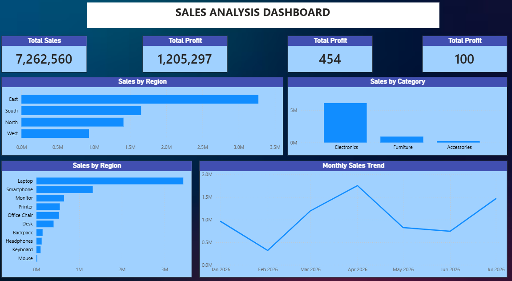

# Sales Analysis Project

## 📊 Project Overview

This project analyzes sales data to identify business performance, sales trends, top-performing products, and regional performance.

The project uses Excel, SQL, and Power BI to perform data cleaning, analysis, and visualization.

## 🛠️ Tools & Technologies

- Excel
- SQL
- Power BI
- Power Query
- DAX

## 🎯 Objectives

- Analyze overall sales performance
- Identify top-performing products
- Analyze sales by region
- Identify monthly sales trends
- Calculate key business KPIs
- Create an interactive Power BI dashboard

## 🔄 Project Workflow

1. Data Collection
2. Data Cleaning using Excel and Power Query
3. Data Analysis using SQL
4. Data Visualization using Power BI
5. Business Insights and Recommendations

## 📈 Key KPIs

- Total Sales
- Total Orders
- Total Quantity Sold
- Average Order Value
- Top-Selling Products
- Regional Sales Performance

## 📁 Project Files

- `Data` – Dataset used for analysis
- `SQL` – SQL queries used for data analysis
- `PowerBI` – Power BI dashboard
- `Screenshots` – Dashboard screenshots

- ## 📊 Power BI Dashboard

## 💡 Key Insights

Insights will be added after completing the analysis and dashboard.

## 👤 Author

**Sachita Nand**

Aspiring Data Analyst | Excel | SQL | Power BI | Data Visualization
